<div align="center">




<br/>

<a href="https://parkjaehwan-906.github.io/shell-page/">
  
</a>

</div>

---

```console
$ whoami
박재환 (hwannee) · Backend Developer
서버를 만들고, 데이터가 흐르는 길을 설계합니다.

$ cat profile.json
{
  "name":   "박재환",
  "role":   "Backend Engineer",
  "stack":  ["Java", "Spring Boot", "MySQL", "Redis", "Docker"],
  "status": "open to work"
}
```

<div align="center">

`⎇ main`  ·  `클릭하면 빨리감기`  ·  `Esc 건너뛰기`

</div>

---

## `$ skills --top`

**Back-End**

<p>


</p>

**Language**

<p>


</p>

**Database**

<p>


</p>

**DevOps**

<p>


</p>

**Infra · Cloud**

<p>


</p>

**Front-End**

<p>


</p>

---

## `$ ls -la ./projects`

```console
total 4
```

| PERM | NAME | 설명 |
|---|---|---|
| `drwxr-xr-x` | **[VictoryFairy](https://github.com/ParkJaeHwan-906/VictoryFairy)** | KBO 팬들이 직접 참여하고 함께 즐길 수 있는 콘텐츠 |
| `drwxr-xr-x` | **[YGSS](https://github.com/ParkJaeHwan-906/YGSS)** | 사회초년생의 현명한 퇴직연금 관리를 위한 추천 서비스 |
| `drwxr-xr-x` | **[onAiR](https://github.com/ParkJaeHwan-906/onAiR)** | 산업 현장을 최적화하는 AI·AR 스마트 헬멧 |
| `drwxr-xr-x` | **[POOKIE](https://github.com/ParkJaeHwan-906/POOKIE)** | mini web game platform |

---

## `$ git log --stat`

<div align="center">


</div>

---

## `$ contact --all`

```console
$ contact --all
```

<p>
<a href="mailto:doormoo2@naver.com">
  
</a>
<a href="https://parkjaehwan-906.github.io">
  
</a>
<a href="https://github.com/ParkJaeHwan-906">
  
</a>
</p>

---

<div align="center">
<sub><code>zsh: 문제를 구조로 푸는 걸 좋아합니다.</code></sub>
</div>
